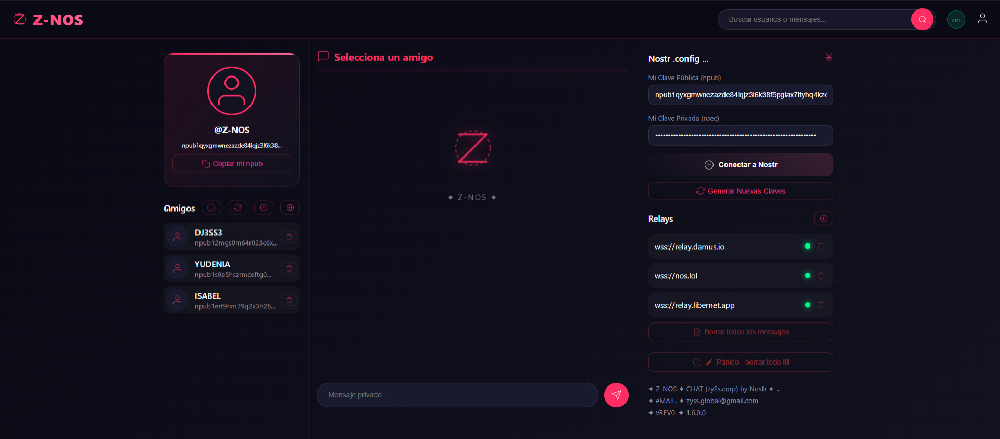
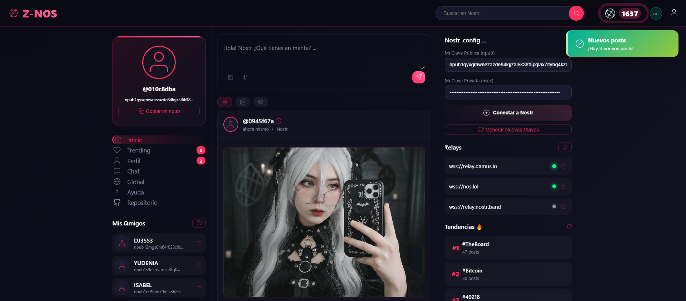
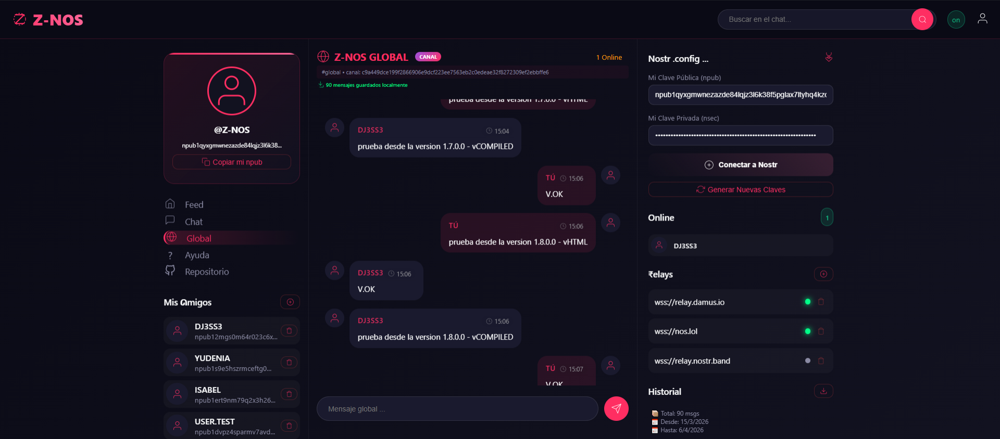
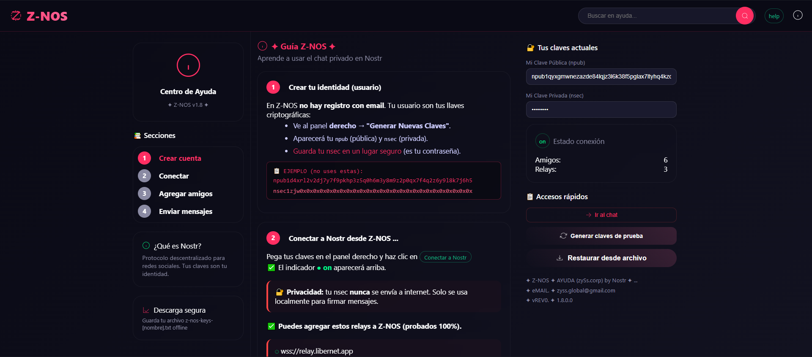
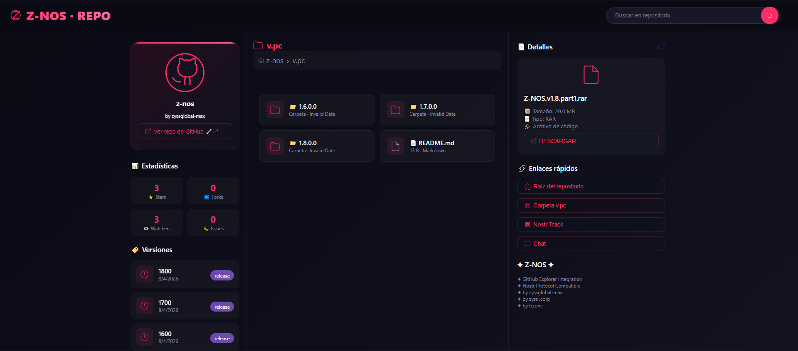
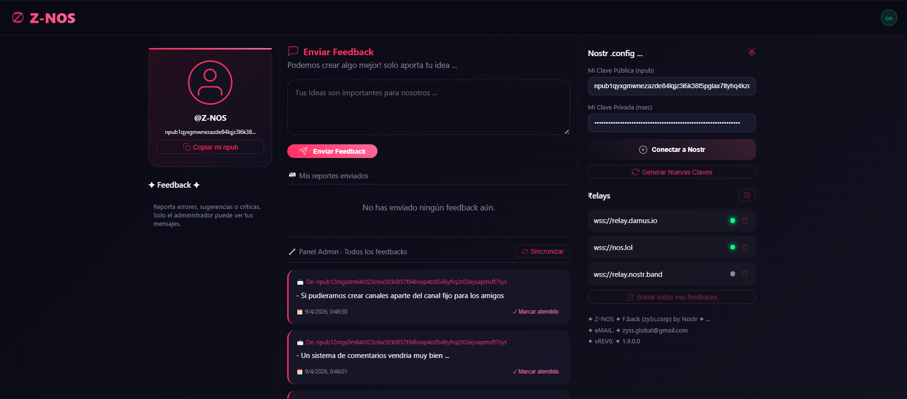
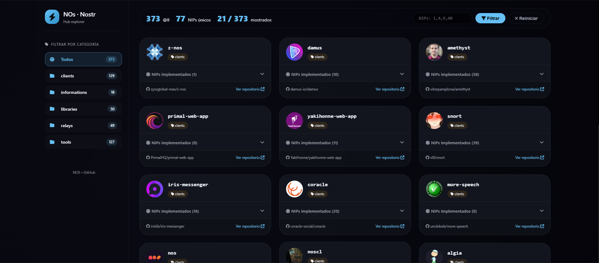

<div align="center">
  <br>
  
  <h1>Z-NOS / Nostr client</h1>
  <p><strong>Cliente Nostr de código abierto para el [protocolo Nostr](https://github.com/nostr-protocol/nostr). Z-NOS es un cliente web enfocado en la privacidad y la comunicación directa a través de mensajes privados cifrados.</strong></p>
  
  <p>
    Libre & de código abierto.<br/>
    Creado por <a href="https://github.com/zyssglobal-max/">ZYSS .CORP</a>, con un estilo moderno, diseño responsive con tema oscuro y animaciones.
  </p>
  
</div>

---

## ✨ Características

- **Mensajes Privados (NIP-04)** - Comunicación cifrada extremo a extremo
- **Gestión de Amigos** - Añade y organiza tus contactos Nostr
- **Múltiples Relays** - Conecta a varios relays simultáneamente
- **Búsqueda Global** - Busca mensajes y usuarios en toda la aplicación
- **Interfaz Moderna** - Diseño responsive con tema oscuro y animaciones
- **Persistencia Local** - Todos los datos se guardan localmente en tu sistema
- **Modo Pánico** - Borra todos tus datos locales con un solo clic

## 🧮 Vista previa



## 📁 Estructura

```text
nos/
├── 🌐 feed      // feed social activo con (Perfil, Trending, likes)
├── 🌐 global    // canal global solo para tus amigos agregados
├── 🌐 help      // ayuda simple para los primeros pasos en z-nos
├── 🌐 index     // chat privado nuestra principal herramienta
├── 🌐 repo      // repositorios con las versiones z-nos desde github.com
├── 🌐 feedback  // reporta errores, sugerencias o críticas ...
└── 🌐 nos       // Red Nostr Promocional (repos) ...
```

├── 🌐 `feed`


├── 🌐 `global`


├── 🌐 `help`


├── 🌐 `index / chat`


├── 🌐 `repo`


├── 🌐 `feedback`


├── 🌐 `Nos promo`


## 📦 Instalación

### Opción 1: Uso Directo (EXE)
1. Descarga los ficheros de la versión mas actual D' `Z-NOS` / [v1.9.0.0](https://github.com/zyssglobal-max/z-nos/tree/main/v.pc/1.9.0.0)
2. Password del .rar 8905
3. Ábrelo en tu sistema windows (portable) ...
4. ¡Listo para usar!
   - [Probar Z-NOS](chat.html) V.HTML - (READY)
   - [Nostr Track](nos.html) V.HTML

<svg width="28" height="28" viewBox="0 0 24 24" fill="#ff4500">
                    <path d="M12 0A12 12 0 0 0 0 12a12 12 0 0 0 12 12 12 12 0 0 0 12-12A12 12 0 0 0 12 0z" fill="#ff4500"></path>
                    <g fill="white" stroke="black" stroke-width="0.8" stroke-linecap="round" stroke-linejoin="round">
                        <path d="M7.2 7.8 L16.8 7.8 Q17.3 7.8 17.3 8.3 L17.3 8.8 Q17.3 9.3 16.8 9.3 L7.2 9.3 Q6.7 9.3 6.7 8.8 L6.7 8.3 Q6.7 7.8 7.2 7.8z" fill="white"></path>
                        <path d="M16.5 8.5 L10.2 15.8 Q9.8 16.2 9.2 15.8 L8.8 15.3 Q8.4 14.9 8.8 14.5 L15 7.2 Q15.4 6.8 16 7.2 L16.5 7.7 Q16.9 8.1 16.5 8.5z" fill="white"></path>
                        <path d="M7.2 15.2 L16.8 15.2 Q17.3 15.2 17.3 15.7 L17.3 16.2 Q17.3 16.7 16.8 16.7 L7.2 16.7 Q6.7 16.7 6.7 16.2 L6.7 15.7 Q6.7 15.2 7.2 15.2z" fill="white"></path>
                    </g>
                    <g stroke="black" stroke-width="0.6" fill="none" stroke-linecap="round">
                        <path d="M5.5 8.5 L7.2 8.5" stroke="black"></path>
                        <path d="M17.3 8.5 L19 8.5" stroke="black"></path>
                        <path d="M18.5 7 L16.8 8.2" stroke="black"></path>
                        <path d="M6.5 16 L8.2 14.8" stroke="black"></path>
                        <path d="M5.5 16 L7.2 16" stroke="black"></path>
                        <path d="M17.3 16 L19 16" stroke="black"></path>
                        <path d="M14 6.5 L15 7" stroke="black"></path>
                        <path d="M9 18 L10 17.5" stroke="black"></path>
                        <circle cx="4.8" cy="12" r="0.5" stroke="black" stroke-width="0.5" fill="none"></circle>
                        <circle cx="19.2" cy="12" r="0.5" stroke="black" stroke-width="0.5" fill="none"></circle>
                    </g>
                </svg>  
