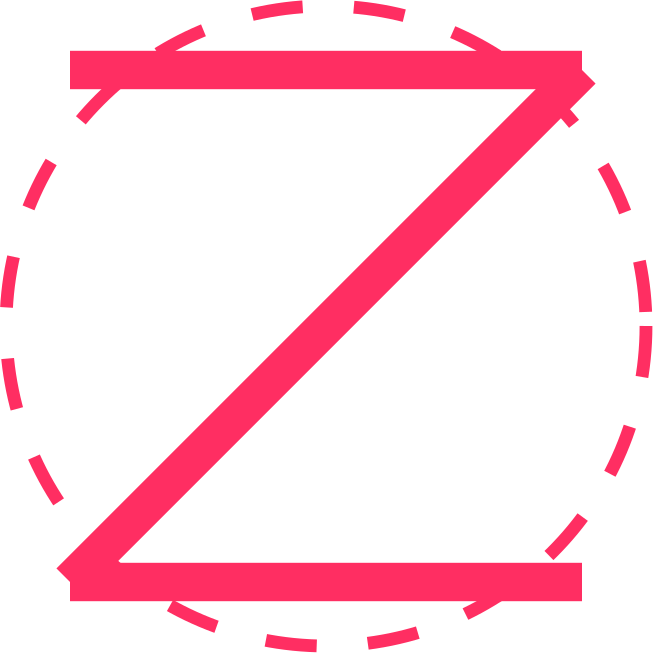
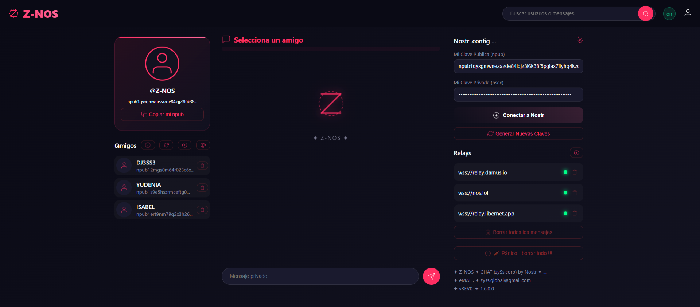
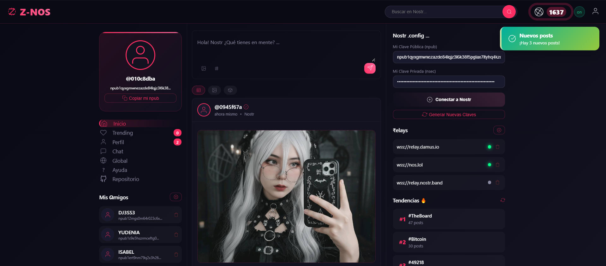
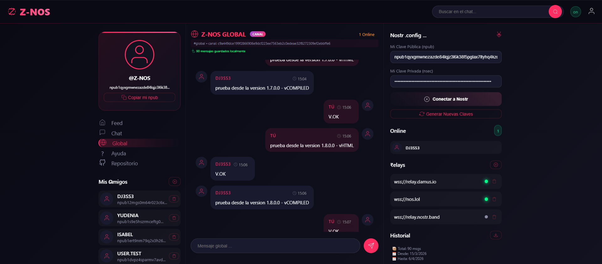
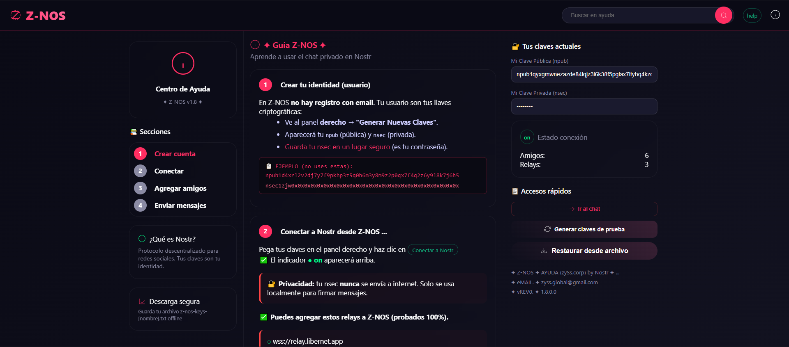
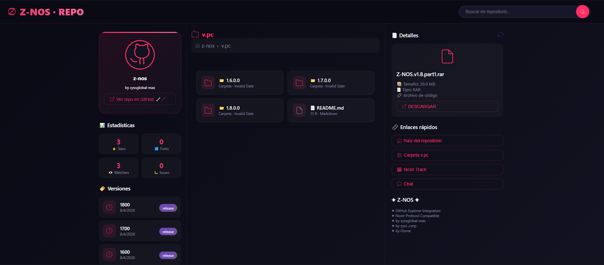
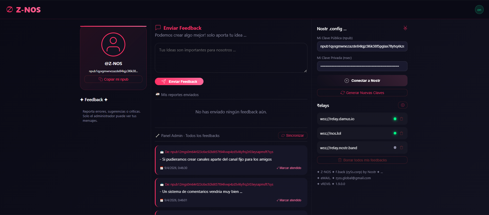
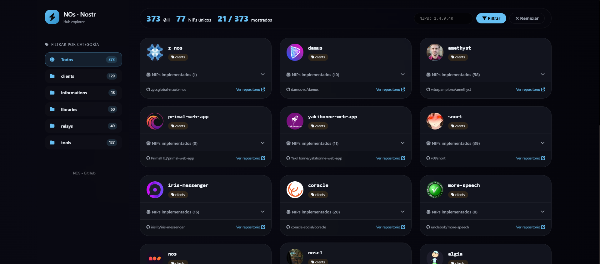

<div align="center">
  <br>
  
  <h1>Z-NOS / Nostr client</h1>
  <p><strong>Cliente Nostr de código abierto para el [protocolo Nostr](https://github.com/nostr-protocol/nostr). Z-NOS es un cliente web enfocado en la privacidad y la comunicación directa a través de mensajes privados cifrados.</strong></p>
  
  <p>
    Libre & de código abierto.<br/>
    Creado por <a href="https://github.com/zyssglobal-max/">ZYSS .CORP</a>, con un estilo moderno, diseño responsive con tema oscuro y animaciones.
  </p>
  
</div>

---

## ✨ Características

- **Mensajes Privados (NIP-04)** - Comunicación cifrada extremo a extremo
- **Gestión de Amigos** - Añade y organiza tus contactos Nostr
- **Múltiples Relays** - Conecta a varios relays simultáneamente
- **Búsqueda Global** - Busca mensajes y usuarios en toda la aplicación
- **Interfaz Moderna** - Diseño responsive con tema oscuro y animaciones
- **Persistencia Local** - Todos los datos se guardan localmente en tu sistema
- **Modo Pánico** - Borra todos tus datos locales con un solo clic

## 🧮 Vista previa



## 📁 Estructura

```text
nos/
├── 🌐 feed      // feed social activo con (Perfil, Trending, likes)
├── 🌐 global    // canal global solo para tus amigos agregados
├── 🌐 help      // ayuda simple para los primeros pasos en z-nos
├── 🌐 index     // chat privado nuestra principal herramienta
├── 🌐 repo      // repositorios con las versiones z-nos desde github.com
├── 🌐 feedback  // reporta errores, sugerencias o críticas ...
└── 🌐 nos       // Red Nostr Promocional (repos) ...
```

├── 🌐 `feed`


├── 🌐 `global`


├── 🌐 `help`


├── 🌐 `index / chat`


├── 🌐 `repo`


├── 🌐 `feedback`


├── 🌐 `Nos promo`


## 📦 Instalación

### Opción 1: Uso Directo (EXE)
1. Descarga los ficheros de la versión mas actual D' `Z-NOS` / [v1.9.0.0](https://github.com/zyssglobal-max/z-nos/tree/main/v.pc/1.9.0.0)
2. Password del .rar 8905
3. Ábrelo en tu sistema windows (portable) ...
4. ¡Listo para usar!
   - [Probar Z-NOS](chat.html) V.HTML - (READY) pc ...
   - [Probar Z-NOS](chat-reponsive.html) V.HTML - (READY) reponsive ...
   - [Nostr Track](nos.html) V.HTML

---
> ZYSS .CORP / somos una sola persona `para curiosos` ...
---
> ZYSS .CORP / `npub1qyxgmwnezazde84lqjz3l6k38f5pglax7ltyhq4kzd3p8s3j53pql2nuek`
---
> DJ3SS3 / `npub12mgs0m64r023c6xc92k6t57t94lvwp4zd5vl6yfrq2r03eysapmsft7sys`
